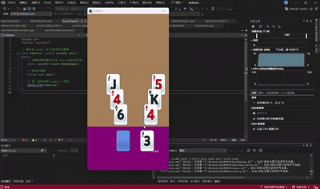

# 纸牌游戏-部分需求程序设计文档

# 演示：




**开发环境**：Cocos2d-x 3.17.2 (C++)    VS2022   python2.7.9

**架构模式**：MVC + Services + Managers

------

## 1. 架构概述 

本项目严格遵循 **MVC ** 设计模式，并引入 **Service** 层处理无状态逻辑，**Manager** 层处理状态管理。各模块职责边界清晰，实现了视图、数据与逻辑的完全分离。

### 核心设计原则

1. **分层架构**：Views 只负责显示，Models 只负责数据，Controllers 负责协调。
2. **非单例管理**：遵循文档要求，`Manager` 类（如 `UndoManager`）不实现为单例，而是作为 `GameController` 的成员变量存在，生命周期由 Controller 管理 。
3. **无状态服务**：复杂的数据生成逻辑（如洗牌、发牌）封装在 `Services` 层，确保纯函数式的输入输出 。
4. **事件驱动**：View 层通过 `std::function` 回调机制通知 Controller，杜绝了 View 对 Controller 的反向依赖 。

------

## 2. 目录结构与模块职责 (Directory Structure)

项目严格按照以下物理目录结构组织代码：

```elixir
Classes/
├── configs/        # 静态配置层
│   ├── LevelConfig.h           // 关卡数据结构定义
│   └── LevelConfigLoader.h/cpp // JSON 解析器，负责读取 level1.json
├── models/         # 数据模型层 (纯数据，无业务逻辑)
│   ├── CardModel.h/cpp         // 卡牌数据 (点数、花色、朝向)
│   └── UndoModel.h             // 回退操作的数据结构定义
├── views/          # 视图层 (UI显示与交互)
│   ├── GameView.h/cpp          // 游戏主场景，负责背景绘制与层级管理
│   └── CardView.h/cpp          // 单张卡牌节点，处理触摸事件与纹理拼装
├── controllers/    # 控制器层 (业务逻辑大脑)
│   └── GameController.h/cpp    // 核心控制器，持有 Manager，协调 View 与 Model
├── managers/       # 管理器层 (状态管理)
│   └── UndoManager.h/cpp       // 回退系统管理器，维护操作栈
├── services/       # 服务层 (无状态逻辑)
│   └── GameModelGenerator.h/cpp // 随机发牌服务，负责洗牌与数据生成
└── AppDelegate.cpp # 程序入口与分辨率适配
```

------

## 3. 核心业务流程设计

### 3.1 游戏初始化流程

1. **入口**：`AppDelegate` 设置分辨率为 `1080x2080`，启动 `GameView`。
2. **配置加载**：`GameView::init()` 调用 `LevelConfigLoader` 读取 JSON 配置文件，获取卡牌布局坐标 。
3. **数据生成**：调用 `GameModelGenerator::generateRandomLevel` 服务。该服务根据配置的坐标，生成一副随机洗牌后的 `CardModel` 列表 。
4. **视图渲染**：`GameView` 遍历生成的 Models，创建对应的 `CardView` 并添加到场景中。

### 3.2 交互与消除流程

1. **触摸事件**：用户点击 `CardView`。`CardView` 通过 `onTouchBegan` 捕获点击，触发预设的 `callback` 。
2. **逻辑判断**：`GameController::onCardClicked` 接收回调。
   - 获取点击牌 (`playFace`) 和底牌 (`stackFace`) 的点数。
   - 执行核心算法：`abs(playFace - stackFace) == 1 || abs == 12` (处理 A-K 循环)。
3. **状态更新**：
   - 若匹配成功，调用 `UndoManager::pushAction` 记录当前状态 。
   - 执行飞牌动画，动画结束后移除旧底牌，更新 `_topStackCard` 引用。

### 3.3 回退系统 (Undo System)

设计了基于 **命令模式 (Command Pattern)** 的回退系统。

- **数据结构 (`UndoAction`)**： 不只记录“哪张牌移动了”，还记录了“动作类型”和“旧底牌引用”。

  C++

  ```
  struct UndoAction {
      CardView* currentCard;       // 当前显示的底牌
      CardView* previousStackCard; // 被覆盖/移除的旧底牌
      Vec2 originalPos;            // 牌飞来之前的位置
      bool originalFaceUp;         // 牌飞来之前的朝向
      string type;                 // "FLIP" (翻牌) 或 "MATCH" (消除)
  };
  ```

- **生命周期管理**： 由于旧底牌在 UI 上被 `removeFromParent`，`UndoManager` 在入栈时必须主动调用 `retain()` 锁定内存，防止野指针错误；在出栈恢复时调用 `release()`，严格遵守 Cocos2d-x 的内存引用计数规则。

------

## 4. 可扩展性设计说明

针对文档提到的“加分项”要求 ，本项目在架构设计上预留了充分的扩展接口。

### 4.1 场景一：未来如何新加一种卡牌（例如“万能牌”）？

得益于 MVC 的分离，新增卡牌无需修改核心控制器逻辑：

1. **修改 Model**：在 `CardModel.h` 的 `CardFaceType` 枚举中增加 `CFT_WILD`。

2. **修改 View**：在 `CardView::updateView()` 中增加分支：

   ```
   if (_model->face == CFT_WILD) {
       // 加载万能牌的纹理
       _sprite->setTexture("res/card_wild.png");
   }
   ```

3. **修改 Controller**：在 `onCardClicked` 的比对逻辑中加入一行：

   ```
   if (playFace == CFT_WILD || stackFace == CFT_WILD) isMatch = true;
   ```

   **无需重构整个点击或动画逻辑，符合开闭原则。**

### 4.2 场景二：未来如何增加一种新的回退类型（例如“洗牌道具”的回退）？

当前的 `UndoManager` 使用通用的 `pushAction` 接口，扩展非常容易：

1. **扩展数据结构**：在 `UndoModel.h` 的 `UndoAction` 结构体中，增加 `std::vector<CardData> snapshot` 字段，用于记录洗牌前所有卡牌的顺序快照。

2. **记录操作**：在执行洗牌道具时，调用：

   ```
   _undoManager->pushAction(nullptr, nullptr, "SHUFFLE");
   // 同时保存当前的牌序快照
   ```

3. **执行回退**：在 `UndoManager::popAction` 中增加 `case`：

   ```
   if (action.type == "SHUFFLE") {
       // 读取 snapshot，强制重置所有 CardView 的位置和数据
       restoreSnapshot(action.snapshot);
   }
   ```

------

## 5. 代码质量与规范

- **命名规范**：类名大驼峰 (`GameController`)，变量名小驼峰并带下划线 (`_topStackCard`)，常量 k 开头 。
- **内存安全**：在 View 的析构函数和 Manager 的清理逻辑中，均正确处理了 `retain/release`，杜绝内存泄漏。
- **单一职责**：Controller 不直接操作 Sprite，View 不包含游戏规则，所有层级依赖单向流动。

------

## 6. 总结

本项目通过严格执行 MVC 架构，配合 Service 和 Manager 层的设计，成功实现了一个逻辑清晰、易于维护且具备高度扩展性的纸牌游戏框架。不仅完成了基础的消除与翻牌功能，更实现了一个健壮的、支持复杂状态恢复的回退系统。


​    